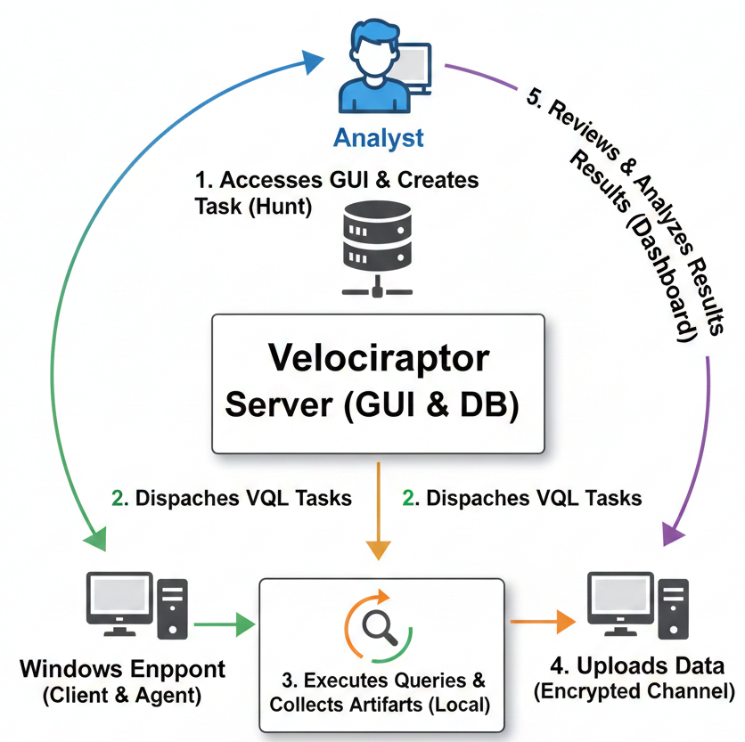

# Velociraptor

Velociraptor is an open-source Digital Forensics & Incident Response (DFIR) tool used to collect, hunt, and analyze forensic data from multiple endpoints using VQL (Velociraptor Query Language). This guide provides a short, clear, beginner-friendly installation walkthrough for a Linux server (Kali example) and a Windows client.

---

## What Velociraptor Does

* Collects system artifacts (files, logs, processes, registry, memory, etc.)
* Performs threat hunting across many machines at once
* Uses lightweight agents
* Supports custom VQL artifacts for flexible investigations

---

## Project Architecture Overview

This project follows a client–server architecture.

### Components Involved

**1 - Velociraptor Server**
* Central management and analysis system
* Hosts the web-based GUI
* Stores collected forensic data
* Sends queries and artifacts to endpoints

**2 - Windows Endpoint (Client)**
* Target system under investigation
* Runs the Velociraptor agent as a service
* Executes artifact collection tasks
* Sends results back to the server

**3 - Analyst**
* Interacts with Velociraptor through the web interface
* Initiates hunts, artifact collection, and analysis
* Reviews collected evidence
I
---
  
## Communication Flow

The communication in this project works as follows:
* The analyst logs into the Velociraptor web interface.
* The server sends VQL-based tasks to the enrolled Windows client.
* The client executes the requested artifact collection locally.
* Collected data is securely sent back to the server.
* The analyst reviews and analyzes the results through the dashboard.

---
