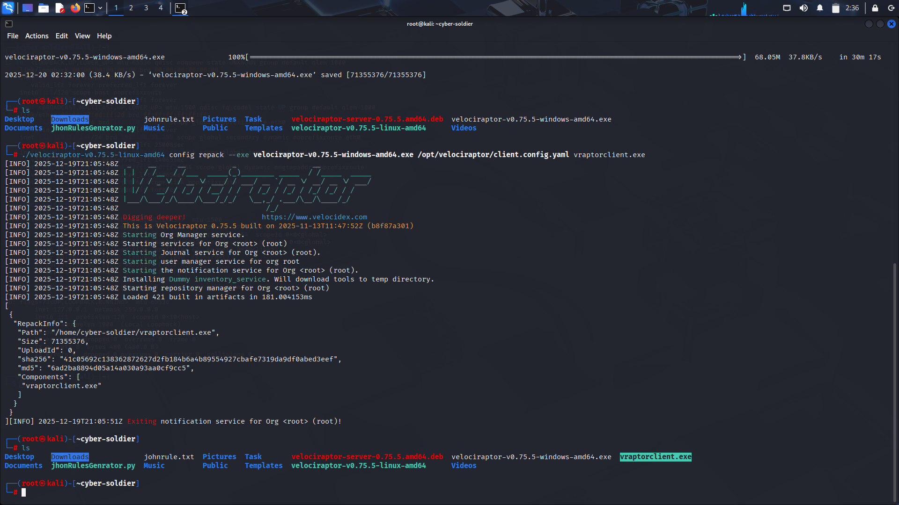
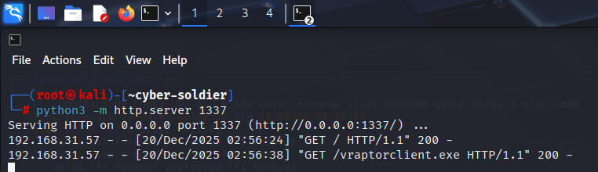
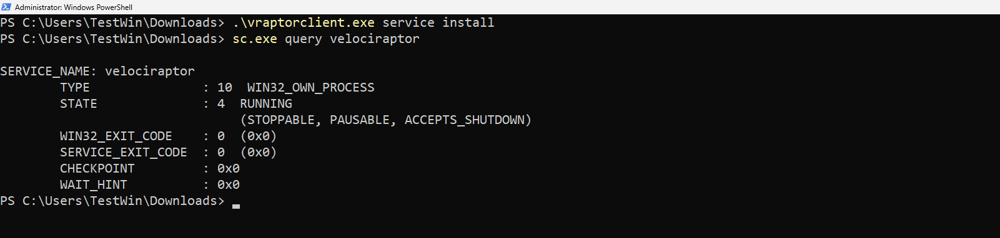
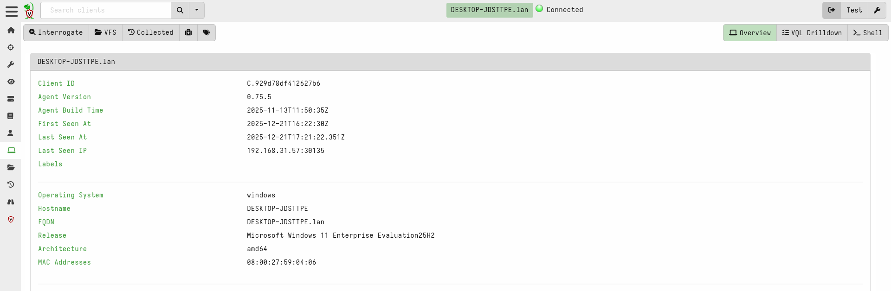

# Windows-Client-Configuration-&-Deployment

---

## On Linux Machine 

## 1. Generate Client Configuration

```bash
sudo ./velociraptor-v0.75.5-linux-amd64 config client --config /opt/velociraptor/server.config.yaml > /opt/velociraptor/client.config.yaml
```

**Explanation:**
Creates a configuration file specifically for clients (Windows agents).

```bash
sudo chown velociraptor:velociraptor /opt/velociraptor/client.config.yaml
```

**Explanation:**
Changes ownership so the Velociraptor service can access the file.

## 2. Download Windows Agent

```bash
wget https://github.com/Velocidex/velociraptor/releases/download/v0.75/velociraptor-v0.75.5-windows-amd64.exe
```

**Explanation:**
Downloads the Windows Velociraptor binary.

## 3. Repack the Windows Agent

```bash
sudo ./velociraptor-v0.75.5-linux-amd64 config repack --exe velociraptor-v0.75.5-windows-amd64.exe /opt/velociraptor/client.config.yaml vraptorclient.exe
```

**Explanation:**
Bundles your server settings **into the agent**, so the client automatically connects.

Check output:

```bash
ls -la
```

**Explanation:**
Verifies the new `.exe` file exists.



## 4. Transfer the Client to Windows

Start a simple web server:

```bash
sudo python3 -m http.server 1337
```

**Explanation:**
Makes your current directory accessible from a browser for easy file transfer.

On Windows → open browser:

```
http://<SERVER-IP>:1337
```

Download `vraptorclient.exe`.



---

## ON Windows Machine

## 1. Install the Client Service (Windows)

Open **PowerShell as Administrator**:

```powershell
.\vraptorclient.exe service install
```

**Explanation:**
Installs Velociraptor as a Windows service and connects automatically to the server.



---

## 🎉 Access Velociraptor Web GUI

Open:

```
https://<SERVER-IP>:8889
```

Log in → You should see the Windows client under **"Clients"**.



---
