# Proactive Threat Hunting Using Velociraptor

## Purpose
Demonstrate a proactive threat-hunting workflow to detect and investigate suspicious activity on a Windows endpoint using Velociraptor.

## Scenario
A user on a Windows endpoint downloads a suspicious file from the internet.  
The analyst investigates the activity, validates the file using threat-intelligence platforms, and quarantines the endpoint.

> ⚠️ Note: A safe test file (EICAR) is used. No real malware is executed.

---

## Step 1: Prepare the Test Scenario
Download the **EICAR test file** on the Windows client using a web browser (e.g., Firefox).  
This simulates a user downloading a potentially malicious file from the internet.

---

## Step 2: Create a Hunt in Velociraptor

1. Open the **Velociraptor Web GUI**
2. Navigate to **Hunt Manager**
3. Click the **➕ (Plus)** icon to create a new hunt
4. Select the required artifacts
5. Launch the hunt

### Selected Artifacts
- `Windows.Application.Firefox.Downloads`
- `Windows.Application.Firefox.History`
- `Windows.Forensics.RecycleBin`
- `Windows.System.PowerShell`
- `Windows.System.Pslist`

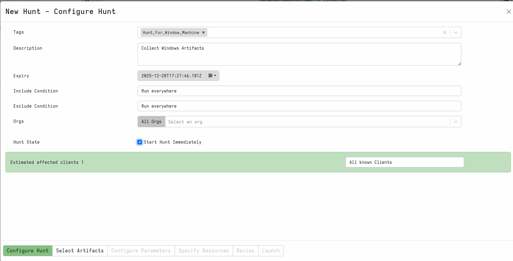

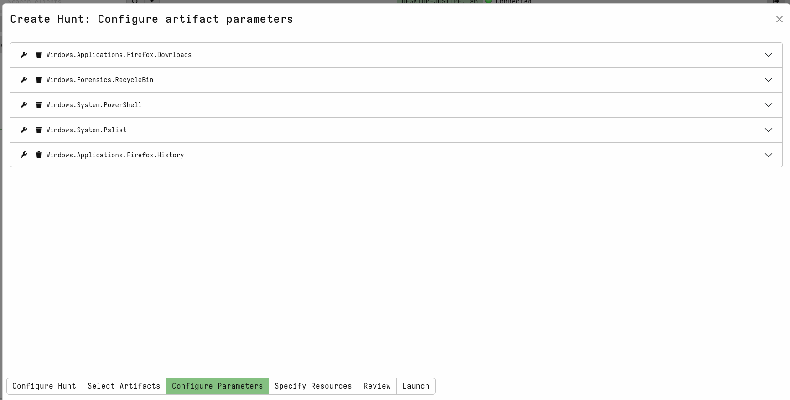

---

## Step 3: Run and Review the Hunt

1. Start the newly created hunt from **Hunt Manager**
2. Wait until the hunt completes

   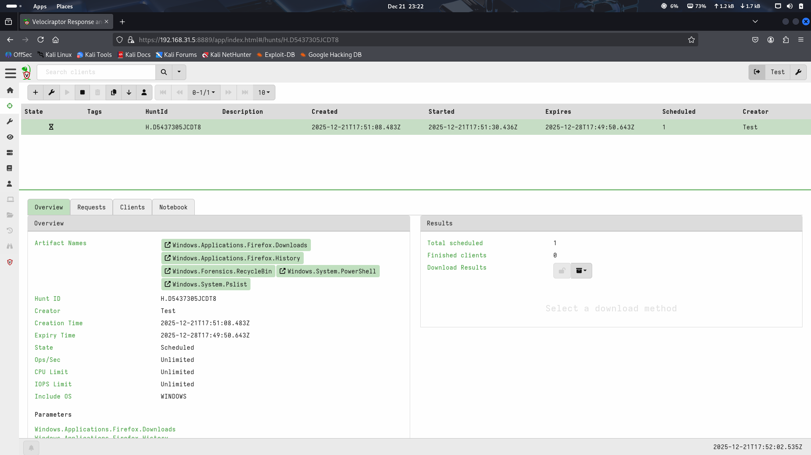

3. Download the hunt results

   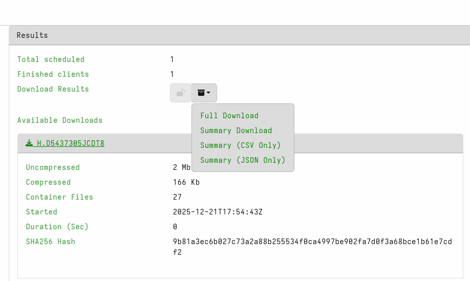
   
6. Extract the downloaded archive

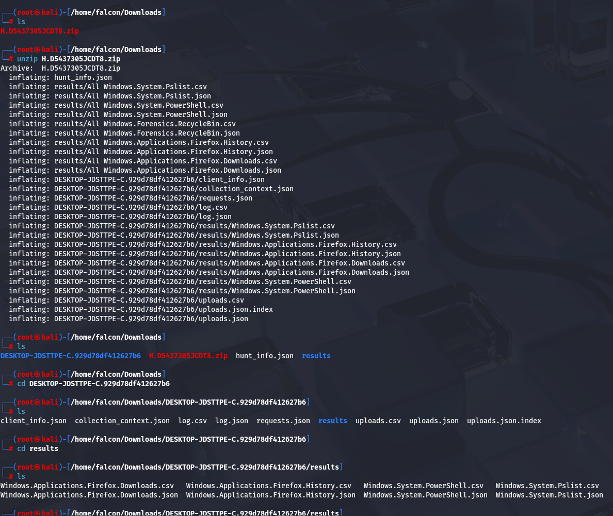

### Findings
- The browser download artifact confirms the file was downloaded via Firefox

  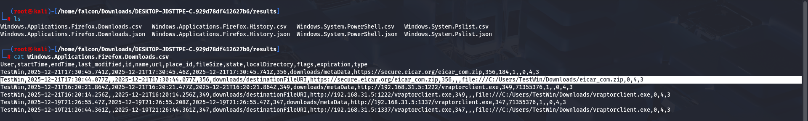
  
- Browser history provides additional context

  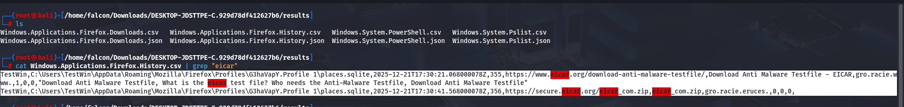
  
- The file path and timestamp are identified

---

## Step 4: Verify Findings Using VFS

1. Select the affected client in Velociraptor
2. Open **Virtual File System (VFS)**
3. Navigate to the file location identified in the hunt
4. Download the suspicious file for analysis

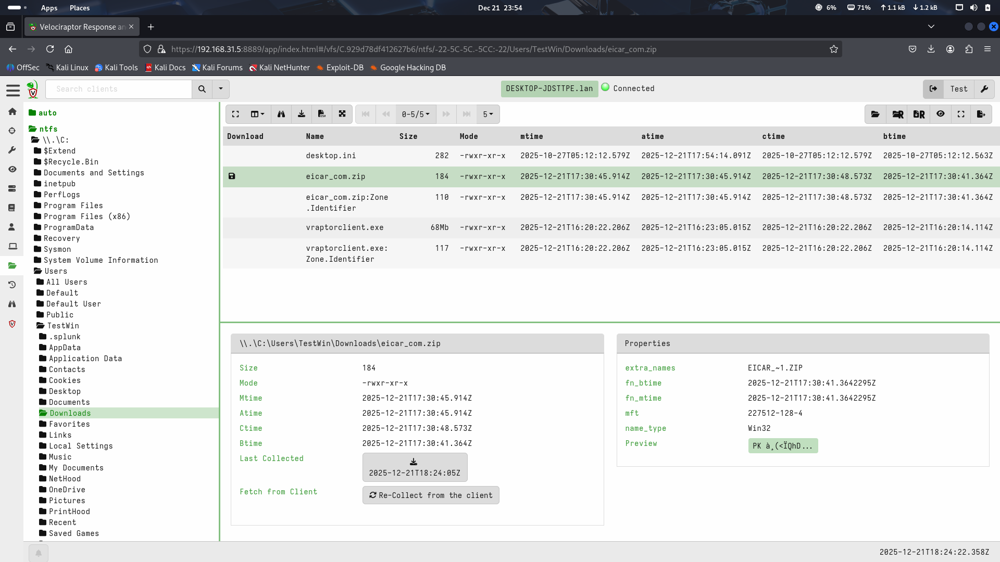

---

## Step 5: Calculate File Hash (Kali Linux)

On an isolated analysis machine (e.g., Kali Linux), calculate the SHA-256 hash:

```bash
sha256sum <filename>
````


---

## Step 6: Validate Hash Using Threat Intelligence

1. Copy the calculated hash
2. Submit it to **VirusTotal** (or any trusted threat-intelligence platform)
3. Review the reputation results

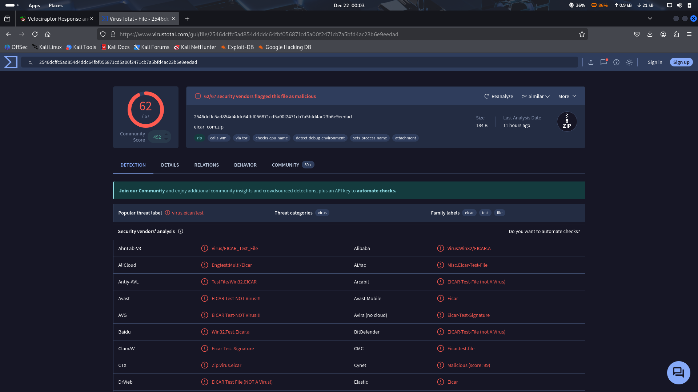

---

## Step 7: Quarantine the Endpoint

After confirming the file is malicious:

1. Return to Velociraptor
2. Quarantine the affected endpoint

   * Disable network access
   * Prevent further activity
3. Document the containment action

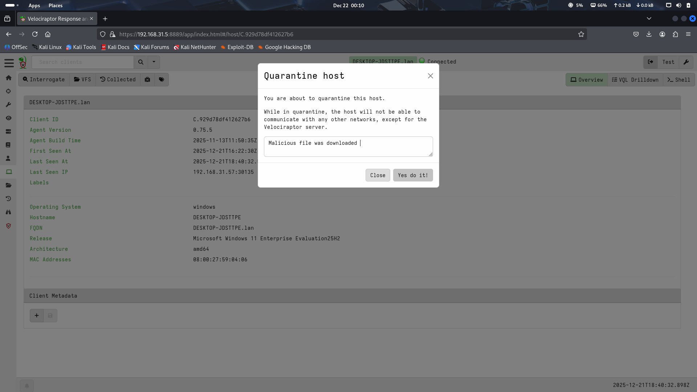

---

## Endpoint Isolation Verification

After initiating the quarantine action from Velociraptor, the following observations confirm successful containment.

### Quarantine Notification on Endpoint
Once the endpoint is quarantined, a notification pop-up is displayed on the Windows system, indicating that the machine has been isolated by the response action.

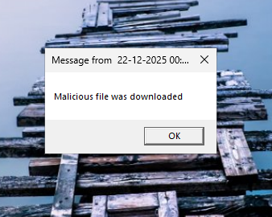

### Network Isolation Validation
To validate the quarantine, a network connectivity test (such as a ping request) is performed.  
The failure of the request confirms that the client machine has been successfully isolated from the network.


---
